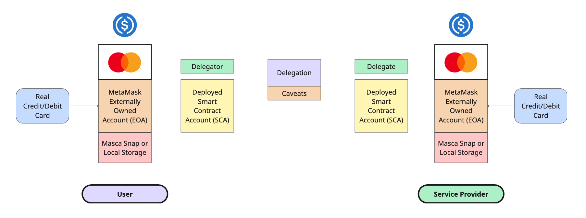

# Service Marketplace & Loyalty Program

### [Watch Service Marketplace Demo Video on Hackquest](https://www.hackquest.io/projects/MetaMask-Card-Dev-Cook-Off-Service-Marketplace-and-Loyalty-Program)

### Spend crypto, earn points, redeem for everyday rewards.

<b>Service Marketplace</b> is a decentralized service marketplace that connects users with local service providers and allows them to purchase a variety of everyday services.

Service Marketplace bridges the gap between traditional and decentralized finance by enabling payments for services via credit/debit card and the MetaMask Card, which is exclusively available through the Service Marketplace Loyalty program.

The <b>Service Marketplace Loyalty Program</b> is a rewards system that incentivizes on-chain spending by allowing users to earn loyalty points redeemable for exclusive perks and benefits. Members enjoy tiered access, unlocking special discounts and rewards at each level.

### Main Features

- **Find & Compare Local Service Providers**: Discover, compare, and purchase services from local service providers.
- **Pay with Circle's USDC**: Use USDC to purchase services and view transaction details on Etherscan.
- **Join the Loyalty Program & Earn Rewards**: Opt in to the Service Marketplace Loyalty Program to earn points for on-chain spending. Redeem points for exclusive rewards and build your on-chain reputation.
- **Use the MetaMask Card & Delegation Toolkit**: Pay for services with your MetaMask Card and set up delegations using the MetaMask Delegation Toolkit (DTK), enabling service providers to pull USDC from the your smart contract account in alignment with a signed service agreement.

# MetaMask Card Dev Cook-Off

## Alignment with Track #3: Identity & On-Chain Reputation

<b>Service Marketplace</b> leverages on-chain identity and behavioral data to power the Service Marketplace Loyalty Program, providing users with tiered access to exclusive perks and rewards from service providers.

### Loyalty Score (0-100)

Each user receives a Loyalty Score after connecting their MetaMask wallet and joining the Service Marketplace Loyalty Program. Users can increase their score through on-chain spending, writing reviews, and completing services.

### Accumulated Points from USDC Payments

Every USDC payment made using the MetaMask Card earns users loyalty points. These points can be accumulated and redeemed for various rewards, such as full service payments, discounts, and cash back.

### Tiered Membership Access

When users opt into the Loyalty Program, they start at the bronze tier with access to basic perks. As they accumulate points throughout the year, they progress into higher tiers, unlocking additional rewards, discounts, and special perks from service providers.

**Note on Tier Discounts:** This loyalty ladder with discount percentages is a work in progress and subject to change.

| Tier      | Points Range       | Points to Next Tier | Discount     |
|-----------|--------------------|---------------------|--------------|
| Bronze    | 0 - 499            | 500 to Silver       | 5% off       |
| Silver    | 500 - 999          | 500 to Gold         | 10% off      |
| Gold      | 1000 - 1999        | 1000 to Platinum    | 15% off      |
| Platinum  | 2000+              | —                   | 20% off      |

### Special On-Chain Rewards

On-chain transactions unlock a variety of rewarding opportunities for users, such as:

- <b>Writing Reviews:</b> Users can write a review only if they have an on-chain transaction with the service provider, enabling honest feedback based on actual experience.
- <b>Giving Referrals:</b> Users who refer others to service providers and make purchases receive special rewards.
- <b>Special Reward Ideas:</b>
  - Earn a special reward for writing a review ($5 off coupon for example).
  - Earn a special reward for writing a review AND referring a friend who purchases a service (20% off for example).
  - Earn a special reward from a service provider for choosing them to be the first purchase on the platform (one-time opportunity).
  - Earn a special reward for being a repeat customer x number of times (3, 5, 10 etc).
  - Earn a special reward for spending a certain $ amount for one transaction (spend $100, get $10 off).
  - Get a special shout out or mention for a service provider after they reach a certain number of reviews (10, 25, 50 etc).

The possibilities are endless and there are a ton of creative ways to reward users for on-chain transactions!

All data is stored locally (either in local storage or via a Masca Snap in the user's EOA), enabling personalized perks without exposing unnecessary information.

## Utilization of MetaMask's Delegation Toolkit (DTK)



<b>MetaMask's Delegation Toolkit (DTK)</b> is essential for allowing service providers to pull funds from a user's smart contract account upon successful completion of a service. The scope of what can be pulled by the service provider is determined through <b>caveats</b> - such as spending limits and time restrictions for withdrawal - and agreed upon in the service contract signed by both the user and service provider.

**Note on Failure to Provide Service**: If the service provider fails to show up or violates the contract, any payment withdrawn will immediately be refunded back to the user.

### Key Hackathon Goals

- **Check** - Explore a real-world use cases of the MetaMask Card.
- **Check** - Use USDC for stablecoin payments.
- **Check** - README with project details and a short recorded demo video.
- **In Progress** - Live hosted demo or working prototype. Currently trying to deploy via Azure - will update this section when app is live.

## Future Improvements

There are several areas for improvement in this project. Some future improvements include:

- Adding functionality for service providers to connect their wallets and list company details, services, and rewards, clickable on the All Services page.
- Building a messaging system that notifies both users and service providers when a service is requested and accepted, a service agreement is signed, or a delegation payment is made.
- Adding more flexibility in selecting preferred or available times when purchasing a service.
- Adding functionality to easily convert cryptocurrency on different chains to USDC using LI.FI.

# Application Setup & Tech Stack

### Important Links & Documentation

- [MetaMask's Website](https://metamask.io/)
- [MetaMask Delegation Toolkit (DTK) Docs](https://docs.metamask.io/delegation-toolkit/)
- [Circle USDC Contract Addresses](https://developers.circle.com/stablecoins/usdc-contract-addresses)
- [Circle USDC Ethereum Sepolia USDC Faucet](https://faucet.circle.com/)
- [Ethereum Sepolia ETH Faucet](https://cloud.google.com/application/web3/faucet/ethereum/sepolia)

### Project Tech Stack

- **Frontend**: React + TypeScript + Vite
- **Backend**: Express.js server with blockchain integration
- **Blockchain**: Ethereum Sepolia testnet with MetaMask's Delegation Toolkit (DTK), Viem
- **Payments**: Pimlico Paymaster, USDC, ETH
- **Storage**: Local Storage (temporary) and Masca Snaps (for production application).

### Prerequisites

- `Node.js v20+`
- `pnpm v10+`
- [MetaMask's Browser Extension](https://chromewebstore.google.com/detail/metamask/nkbihfbeogaeaoehlefnkodbefgpgknn?hl=en)

## Local Setup

### 1. Clone Repo

```sh
git clone git@github.com:RichCanvas3/service-marketplace.git

cd service-marketplace
```

### 2. Create & Populate Environment Variables

```sh
touch client/.env
touch server/.env

# Add necessary environment variables
```

**Required Client Environment Variables (client/.env)**

```
VITE_DEBUG=@veramo/*
VITE_SEPOLIA_RPC_URL=https://eth-sepolia.g.alchemy.com/v2/cxed5uOA7ERjrPuukGXVe
VITE_MAINNET_RPC_URL=https://eth-mainnet.g.alchemy.com/v2/cxed5uOA7ERjrPuukGXVe

# Requires Keys

PIMLICO_API_KEY=pim_...
VITE_BUNDLER_URL=https://api.pimlico.io/v2/11155111/rpc?apikey=pim_...
VITE_PAYMASTER_URL=https://api.pimlico.io/v2/11155111/rpc?apikey=pim_...
```

**Required Server Environment Variables (server/.env)**

```
OPTIMISM_RPC_URL=https://opt-mainnet.g.alchemy.com/v2/cxed5uOA7ERjrPuukGXVe
MAINNET_RPC_URL=https://eth-mainnet.g.alchemy.com/v2/cxed5uOA7ERjrPuukGXVe
SEPOLIA_RPC_URL=https://eth-sepolia.g.alchemy.com/v2/cxed5uOA7ERjrPuukGXVe

# Requires Keys

PIMLICO_API_KEY=pim_...
BUNDLER_URL=https://api.pimlico.io/v2/11155111/rpc?apikey=pim_...

# MetaMask Wallet Private Keys (64 Char String as Hex, like: 0xd60197b16dfada3d389fcf5cce94ee4baf634413c7001c0ccd2dfdbe654f0ab2)

SERVER_PRIVATE_KEY=0x...
DELEGATE_PRIVATE_KEY=0x...
```

### 3. Install Dependencies & Run Build

```sh
pnpm install
pnpm run build
```

### 4. Run Client & Server

```sh
open http:localhost:5173
cd client
pnpm run dev
```

```sh
open http:localhost:3001
cd server
npx tsx src/index.ts
```

## Getting Started

**Note on Application Functionality**: In order to properly use the application locally and deploy their smart contract account (SCA), users must first drip SepoliaETH into their EOA using the **Ethereum Sepolia ETH Faucet** above. Once the SCA is deployed, they must then drip USDC into their SCA using the **Circle USDC Ethereum Sepolia USDC Faucet** above. This order is critical.

1. **Connect Wallet**: Click "Connect Wallet" to connect your MetaMask EOA
2. **Browse Services**: Explore the 7 different service providers on the application
3. **Book Services**: Select services and complete the booking process
4. **Sign Contracts**: Digitally sign service agreements using MetaMask
5. **Complete Payments**: Execute payments through the MetaMask Delegation Toolkit (DTK)
6. **Build Reputation**: Earn reputation points through service and payment completion
7. **Access Premium Services**: Unlock premium services with high reputation scores

## Project EIPs and ERCs Used

- **ERC-20** - USDC Token Transfer
- **EIP-712** - Typed-Structured Data Signing
- **EIP 1271** - Contract-Based Signature Validation
- **EIP/ERC-4337** - Account Abstraction

## Project Structure

```
.
├── client/           # Frontend application
├── server/           # Backend server
└── shared/           # Shared TypeScript code
    ├── src/
    │   ├── agents/  # Veramo agent configuration
    │   └── utils/   # Shared utilities and types
```

## License

MIT